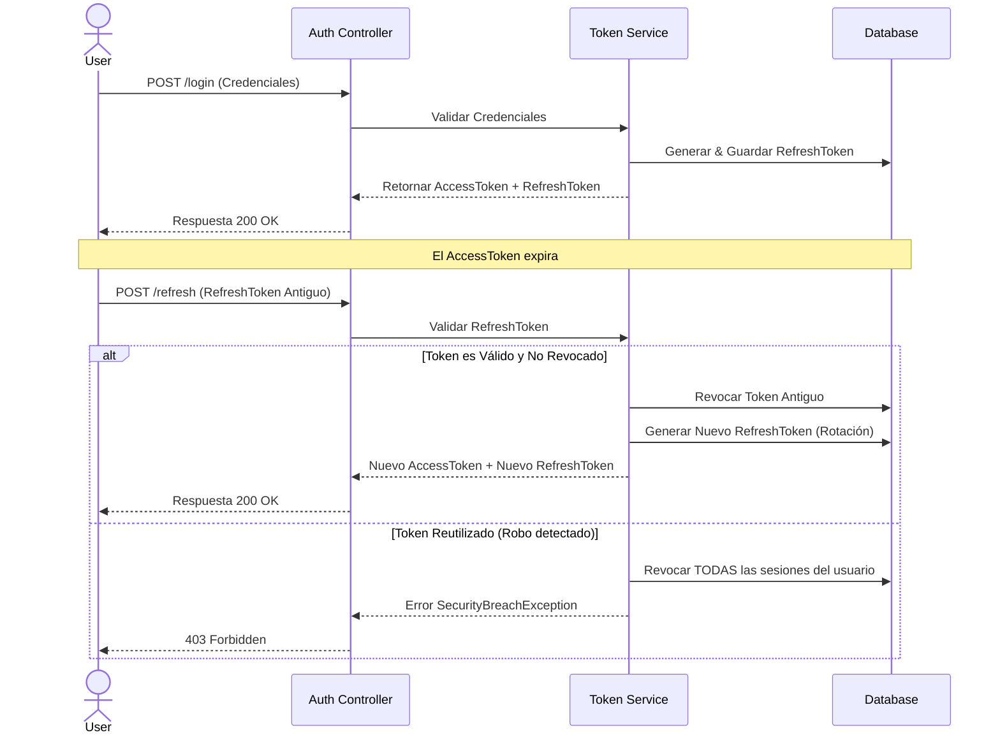
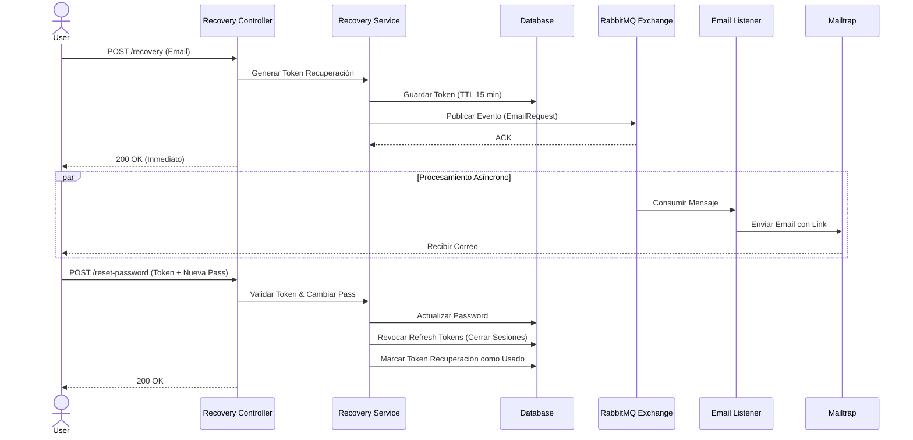

## Sistema de Autenticación JWT con Arquitectura Hexagonal
Este proyecto implementa un sistema robusto de autenticación y autorización utilizando **Spring Boot 3** y **Java 21**.
El diseño sigue los principios de **Arquitectura Hexagonal (Puertos y Adaptadores)**, garantizando un bajo acoplamiento 
y alta mantenibilidad.

El sistema incluye gestión completa de sesiones mediante **JWT (Access y Refresh Tokens)** con rotación automática,
revocación de tokens (Blacklist), y un flujo asíncrono de recuperación de contraseñas utilizando **RabbitMQ**.

### Características Principales
**Seguridad y Autenticación**
- **Gestión de JWT**: Implementación dual de tokens (Access Token de vida corta y Refresh Token de vida larga).
- **Rotación de Refresh Tokens**: Detección de robo de tokens. Si se intenta reutilizar un Refresh Token antiguo,
se invalida toda la cadena de sesiones del usuario.
- **Logout Seguro**: Mecanismo de lista negra (Blacklist) para invalidad Access Tokens antes de su expiración natural.
- **Seguridad RBAC**: Control de acceso basado en roles (`ADMIN`, `CLIENT`).

**Recuperación de Contraseñas**
- **Flujo Asíncrono**: Desacoplamiento del envío de correos utilizando RabbitMQ.
- **Infraestructura Resiliente**: Configuración de Dead Letter Queue (DLQ) para manejar fallos en el envío de correos.
- **Seguridad**: Al restablecer la contraseña, se revocan automáticamente todas las sesiones activas del usuario.

**Arquitectura y Calidad**
- **Arquitectura Hexagonal**: Separación estricta entre Dominio, Aplicación e Infraestructura.
- **Documentación API**: Integración con Swagger UI / OpenAPI 3.
- **Manejo de Errores Globales**: Respuestas estandarizadas utilizando `ProblemDetail` (RFC 7807).

---

###  Stack Tecnológico
- **Lenguaje**: Java 21
- **Framework**: Spring Boot 3.3+
- **Seguridad**: Spring Security 6, JJWT (0.12.x)
- **Base de Datos**: MySQL 8
- **Persistencia**: Spring Data JPA
- **Mensajería**: RabbitMQ
- **Mapeo**: MapStruct
- **Documentación API**: OpenAPI 3
- **Herramientas**: Lombok, Docker, Docker Compose

---

### Diagrama de Arquitectura
1. **Flujo de Autenticación y Rotación de Tokens**: Este sistema representa cómo el sistema maneja el inicio de sesión
y la renovación segura de tokens.



2. **Flujo de Recuperación de Contraseña (Asíncrono)**: Muestra cómo se utiliza RabbitMQ para desacoplar el servicio de recuperación del envío de correos.



---

### Instalación y Ejecución

**Requisitos Previos**
- Docker y Docker Compose instalados.
- Java 21 (Opcional si se usa Docker).

**Configurar variables de entorno**

Copiar el archivo de ejemplo:
```
cp .env.example .env
```
Completar con tus valores (ejemplo de configuración):
```
# MySQL
# ¡IMPORTANTE! MYSQL_USER debe ser un usuario distinto a 'root'.
# La imagen de Docker ya crea al usuario root internamente usando MYSQL_ROOT_PASSWORD.
MYSQL_ROOT_PASSWORD=tu_password_root_secreto
MYSQL_DATABASE=jwt_app
MYSQL_USER=jwt_user        # <--- No usar 'root' aquí
MYSQL_PASSWORD=password_usuario

# JWT
JWT_SECRET=clave_super_segura_32_chars_minimo
ACCESS_EXPIRATION=900        # 15 minutos (en segundos)
REFRESH_EXPIRATION=1209600   # 14 días (en segundos)

# Mailtrap SMTP
MAIL_USER=tu_usuario_mailtrap
MAIL_PASS=tu_password_mailtrap

# RabbitMQ
RABBITMQ_USER=guest
RABBITMQ_PASS=guest
# ... (configuración de colas estándar) ...

# ============================
# Configuración Avanzada (Opcional)
# ============================
# Puerto de la aplicación
SERVER_PORT=8080

# Comportamiento de Base de Datos
# 'update': Para desarrollo (crea/actualiza tablas automáticamente)
# 'validate': Para producción (solo verifica que el esquema sea correcto)
JPA_DDL_AUTO=update

# Rendimiento
DB_POOL_SIZE=10
```
**Ejecutar con Docker Compose**

Para levantar la aplicación junto con MySQL y RabbitMQ:
```
docker-compose up --build
```
Servicios disponibles tras el despliegue:
- **API REST**: `http://localhost:8080`
- **Swagger UI**: `http://localhost:8080/swagger-ui/index.html`
- **RabbitMQ Management**: `http://localhost:15672` (User: guest / Pass: guest)

---

### Estructura del Proyecto
El proyecto sigue una estructura de paquetes orientada al dominio y a la arquitectura hexagonal:
```
src/main/java/com/ejemplos/jwt
├── application
│   ├── ports           # Interfaces (Puertos de Entrada/Salida)
│   └── service         # Implementación de Casos de Uso (Lógica de Negocio)
├── domain
│   ├── model           # Entidades de Dominio Puras
│   ├── exception       # Excepciones de Dominio
│   └── repository      # Interfaces de Repositorio (Puertos)
├── infrastructure
│   ├── web             # Adaptadores Web (Controllers, DTOs, Handlers)
│   ├── persistence     # Adaptadores de Base de Datos (JPA Entities, Repositorios)
│   ├── security        # Configuración de Spring Security y Filtros JWT
│   ├── messaging       # Adaptadores de RabbitMQ (Publisher/Listener)
│   └── documentation   # Configuración de OpenAPI
└── JwtApplication.java
```

---

### Endpoints Principales
La documentación completa y ejecutable está disponible en Swagger UI

**Auth**
- `POST /api/auth/register` - Registro de nuevos usuarios.
- `POST /api/auth/login` - Inicio de sesión (Retorna Access + Refresh Token).
- `POST /api/auth/refresh` - Solicitar nuevo Access Token.
- `POST /api/auth/logout` - Cerrar sesión (Requiere Auth Header).

**Recovery**
- `POST /api/auth/recovery` - Solicitar email de recuperación.
- `POST /api/auth/reset-password` - Establecer nueva contraseña.

**Users (Protected)**
- `POST /api/users/admin` - Solo rol ADMIN.
- `POST /api/users/client` - Solo rol CLIENT.
- `POST /api/users/common` - Tanto ADMIN como CLIENT.
